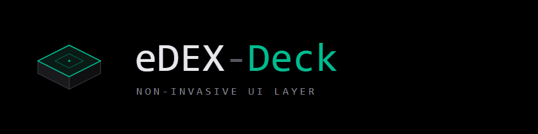
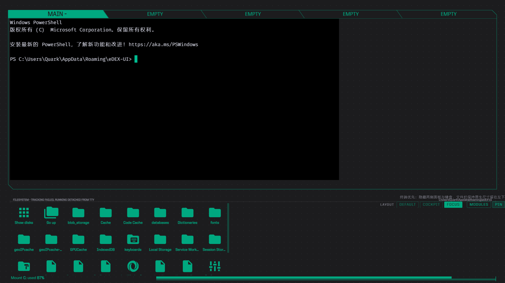
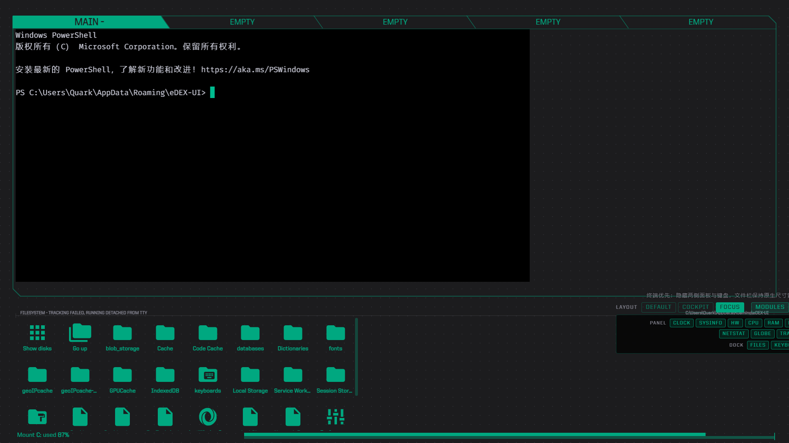
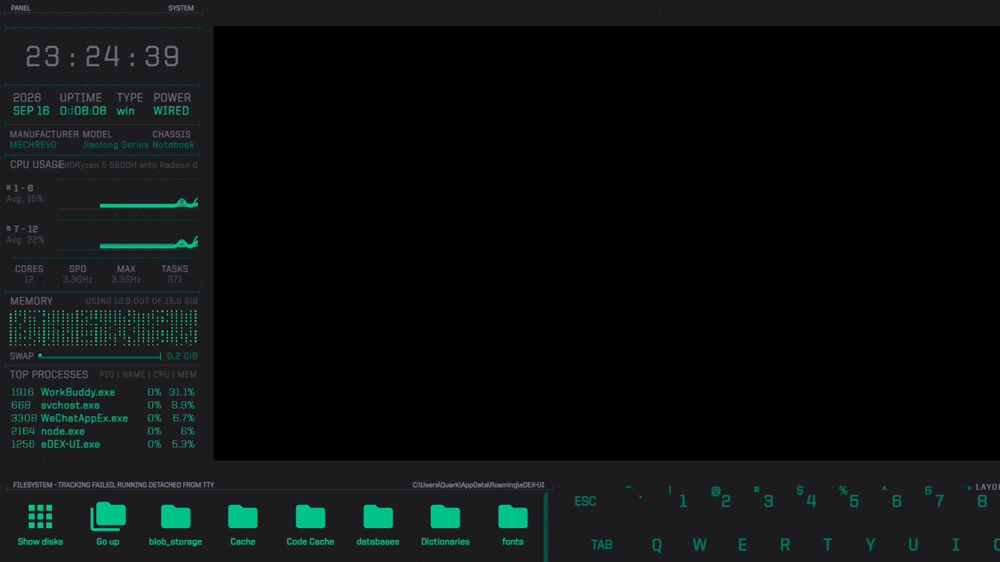
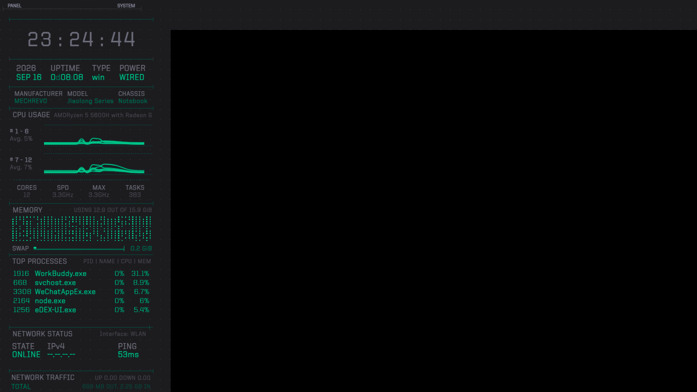
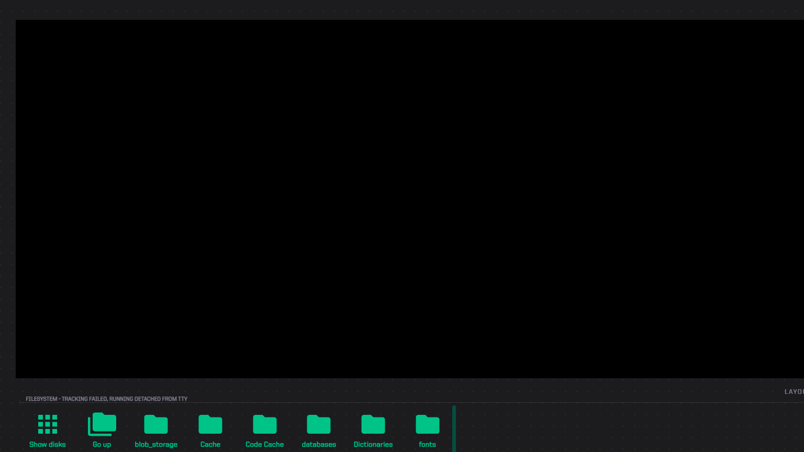
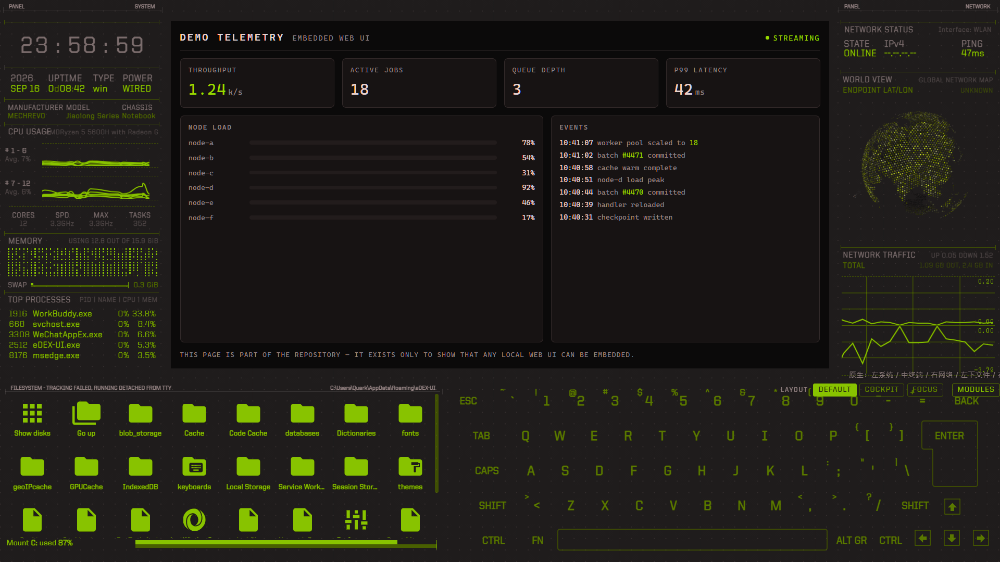

<div align="center">



**A non-invasive UI layer for [eDEX-UI](https://github.com/GitSquared/edex-ui)**

Rearrange the layout, toggle individual panels, embed any local Web UI — **without modifying a single file**.

[](LICENSE)
[](https://www.python.org/)
[](#requirements)
[](https://github.com/GitSquared/edex-ui)

</div>

---

## Screenshots

| Layout dock | Module toggles |
|---|---|
|  |  |

| `DEFAULT` | `COCKPIT` | `FOCUS` |
|---|---|---|
|  |  |  |

Embedding a local Web UI into the centre pane — here the bundled `examples/demo-ui.html`:



---

## Why "non-invasive"

eDEX-UI was archived in October 2021 and ships Electron 12 / Chromium 89. Patching it means rebuilding the whole renderer, and any fork inherits GPL-3.0.

eDEX-Deck takes the opposite approach — it drives a **running** instance over the Chrome DevTools Protocol:

| | |
|---|---|
| Files in the install directory | **never touched** |
| `settings.json` | **never touched** |
| What actually changes | launch flags + an in-memory injection |
| After eDEX exits | **nothing left behind** |

That also keeps this project free of eDEX-UI's source code, so it can be MIT.

---

## Features

- **Layout dock** — a draggable, snap-to-edge floating panel inside eDEX
- **Three layout presets** — `DEFAULT`, `COCKPIT` (all panels stacked in the left column), `FOCUS` (terminal takes over)
- **Per-module toggles** — 11 panels can be shown/hidden independently of the preset
- **Edge snapping** — pin the dock to any screen edge; it collapses to a 9 px tab and slides out on hover
- **Embed any local Web UI** — eDEX's centre pane is a real PTY; eDEX-Deck can overlay it with a `BrowserView` pointing anywhere
- **Auto polyfill** — injects missing ES2022 APIs so modern Web apps run on Chromium 89
- **Theme included** — a `deck-teal` theme, plus tooling to build your own from a screenshot

---

## Download

Prebuilt binaries are attached to every [release](https://github.com/Docking666/edex-deck/releases). They bundle Python — the only thing you need installed is eDEX-UI itself.

| Platform | File | Notes |
|---|---|---|
| Windows | `edex-deck.exe` | single file, just double-click |
| Windows | `edex-deck-portable-*.zip` | folder build, starts instantly |
| macOS | `edex-deck.dmg` | |
| Linux | `edex-deck` | `chmod +x` first |

Launching the binary with no arguments injects the dock and stays running until you close eDEX. Keep `edex-deck.json` next to the binary to use profiles.

---

## Requirements (running from source)

- eDEX-UI **2.2.x** installed ([releases](https://github.com/GitSquared/edex-ui/releases))
- Python **3.8+**
- `pip install websocket-client`
- Windows, macOS or Linux

---

## Quick start

```bash
git clone https://github.com/<you>/edex-deck.git
cd edex-deck
pip install websocket-client

# inject the layout dock into a freshly launched eDEX
python src/inject.py
```

eDEX-Deck launches eDEX with a debugging port, waits for the UI to build, injects the dock, then steps aside. By default it closes eDEX when it finishes — use `--keep` to leave it running.

### Embed any local Web UI

The centre pane is just a `BrowserView` pointed at a URL — **anything that speaks HTTP can live there**. VS Code in the browser (`code-server`), JupyterLab, Grafana, a self-hosted dashboard, a status page, or your own front end.

The repo ships a self-contained demo so you can see it working right away:

```bash
# serve examples/ on a local port
python -m http.server 8898 --directory examples

# in another shell, embed it
python src/inject.py --url "http://127.0.0.1:8898/demo-ui.html"
```

If the program prints its own URL on startup, let the injector launch it and pick the URL up automatically:

```bash
python src/inject.py --serve "code-server --port 8898 --auth none"
```

#### Profiles — one command per target

Toggling between targets by hand gets old, so `edex-deck.json` holds named profiles:

```json
{
  "profiles": {
    "vscode":  { "desc": "VS Code in the browser", "url": "http://127.0.0.1:8080/" },
    "jupyter": {
      "serve": "jupyter lab --no-browser --ServerApp.token= --port {port}",
      "servePort": 8899,
      "url": "http://127.0.0.1:8899/lab"
    }
  }
}
```

```bash
python src/inject.py --profile vscode      # or: launch.cmd --profile vscode
python src/inject.py --profile jupyter
```

`{python}` expands to the interpreter running the injector, so profiles don't depend on `python` being on `PATH`. Any CLI flag still overrides the profile. Since a profile is just a command, each one can get its own desktop shortcut.

### Windows: one-click launcher

Double-click **`launch.cmd`**. It locates Python, installs `websocket-client` if it's missing, then starts eDEX with the dock injected — and exits when you close eDEX.

To put a shortcut with the proper icon on your Desktop:

```powershell
powershell -ExecutionPolicy Bypass -File tools\install-shortcut.ps1
```

`launch.cmd` forwards any extra arguments to the injector, so you can keep a second shortcut for a specific embedded Web UI:

```cmd
launch.cmd --profile vscode
```

### Useful flags

| Flag | Effect |
|---|---|
| `--edex <path>` | Explicit eDEX executable (otherwise auto-detected) |
| `--keep` | Don't shut eDEX down afterwards |
| `--no-layout` | Inject only the embedded Web UI |
| `--debug-port <n>` | Change the CDP port (default `9333`) |
| `--capture-docs` | Screenshot every layout preset into `docs/screenshots/` |

---

## The layout dock

```
LAYOUT [DEFAULT] [COCKPIT] [FOCUS] | MODULES | PIN
```

- **Drag** it anywhere. Position is remembered in `localStorage`.
- **`MODULES`** opens the panel toggles — 11 modules, grouped by `PANEL` / `DOCK`.

  | Group | Modules |
  |---|---|
  | `PANEL` | `CLOCK` `SYSINFO` `HW` `CPU` `RAM` `PROC` `NETSTAT` `GLOBE` `TRAFFIC` |
  | `DOCK` | `FILES` `KEYBOARD` |

- **`PIN`** enables edge snapping. Drag the dock to a screen edge, release, and it collapses to a 9 px tab that slides out on hover.
- **Double-click** the dock to cancel snapping and return to the bottom-right corner.

Presets control *how things are arranged*; module toggles control *what is shown*. They compose — e.g. `FOCUS` + only `CPU`/`RAM`/`NETSTAT` gives you a minimal monitor.

### What each preset does

| Preset | Layout |
|---|---|
| `DEFAULT` | eDEX native — system panels left, network right, files and keyboard along the bottom |
| `COCKPIT` | Both panel columns merged into the left; keyboard and file browser step aside; terminal expands |
| `FOCUS` | Side panels and keyboard hidden; terminal takes the screen; file browser stays at native size |

---

## Themes

A matching theme lives in `src/themes/deck-teal.json` — a teal-on-black palette, with the label text desaturated so only live data carries colour. It was derived from a screenshot using the tooling below.

Install it by copying into your eDEX theme directory:

```bash
# Windows
copy src\themes\deck-teal.json "%APPDATA%\eDEX-UI\themes\"

# macOS / Linux
cp src/themes/deck-teal.json ~/.config/eDEX-UI/themes/
```

Then set `"theme": "deck-teal"` in `settings.json`.

> ⚠️ `settings.json` is **not necessarily UTF-8** (it can contain locale-encoded text). `tools/apply_theme.py` edits it as raw bytes with a regex, never through a JSON round-trip, so nothing gets mangled.

### Build your own from a screenshot

```bash
python tools/palette.py shot.png          # dominant colours + key samples
python tools/preview_theme.py mytheme     # try it, then auto-restore settings.json
```

`tools/palette.py` has **zero dependencies** — it decodes PNG with `zlib` and a hand-written unfilter pass.

---

## How it works

```
1. launch eDEX with --remote-debugging-port
2. GET /json/list            -> find the renderer target (ui.html)
3. poll until the UI is built (eDEX builds everything from JS at runtime)
4. Runtime.evaluate:
     - create a BrowserView for the embedded Web UI   (optional)
     - install a polyfill on the embedded page        (optional)
     - inject the layout dock
5. Page.captureScreenshot / exit
```

A few things that bite, and how they're handled:

| Problem | Handling |
|---|---|
| `ELECTRON_RUN_AS_NODE` in the shell makes the Electron binary behave as plain Node and reject `--flags` | env vars are stripped before launch |
| eDEX's CSP (`default-src file:`) blocks `http` iframes | a `BrowserView` is used instead — it's a separate `webContents`, unaffected by the host CSP |
| Modern Web UIs assume newer Chromium APIs (`Object.hasOwn` etc.) | polyfill injected via `Page.addScriptToEvaluateOnNewDocument` before the page loads |
| `#main_shell` has a `.5 s` size transition | the embedded view re-syncs its bounds ~620 ms after a layout change |
| The update checker throws when offline and covers the UI with a modal | a timer-based guard removes it |

---

## Known limitations

- **Windows**: eDEX cannot track the terminal's working directory, so the file browser stays detached. That's an upstream limitation — the UI even says `TRACKING FAILED`.
- **`COCKPIT` hides the file browser.** eDEX's file grid stops rendering once its container is resized, so rather than show an empty box the preset gives the space to the terminal.
- The dock is injected **at runtime**, so it must be re-injected each time eDEX starts. If you'd rather have a fixed layout that persists without injecting, put the layout CSS into a theme's `injectCSS` field instead.
- Tested against eDEX-UI 2.2.8 / Electron 12.2.2 on Windows. Other versions may need selector updates — `tools/dump_modules.py` prints the module IDs actually present in a running instance.

---

## Not affiliated

eDEX-Deck is an independent, unofficial tool. It is not affiliated with or endorsed by the eDEX-UI project or its author. eDEX-UI itself is licensed **GPL-3.0**; this project contains none of its code and interacts with it only at runtime.

---

## License

[MIT](LICENSE)
